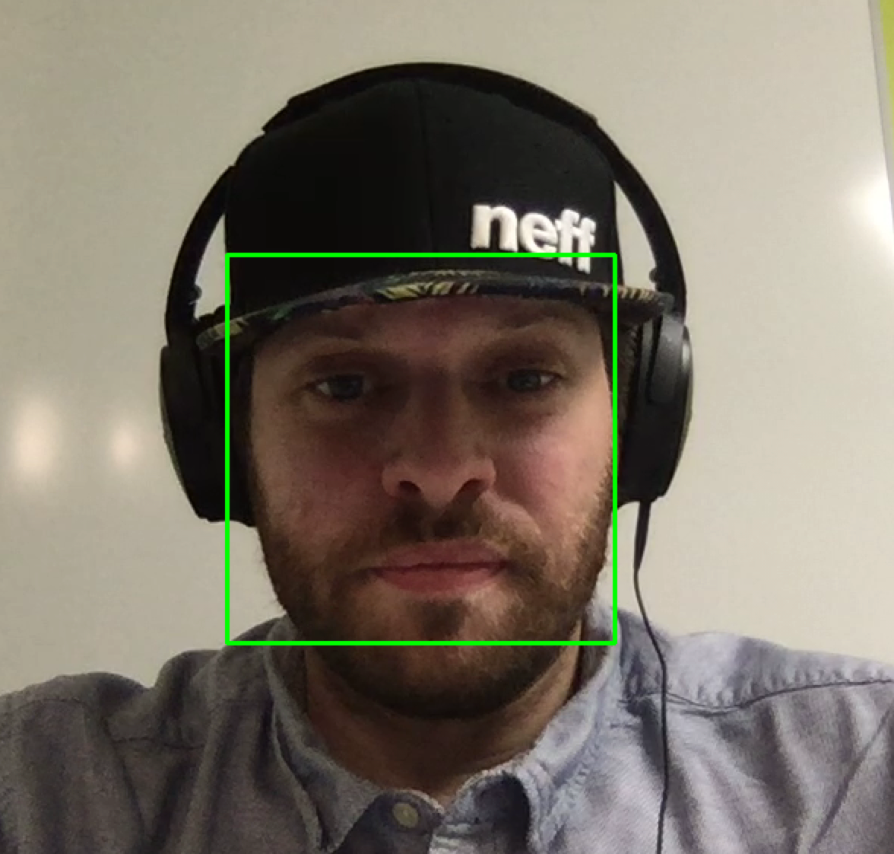

# webcam-head-tracker

Just applying : [https://realpython.com/blog/python/face-detection-in-python-using-a-webcam/](https://realpython.com/blog/python/face-detection-in-python-using-a-webcam/)

* Run `source ./scripts/CreatVenv.sh`
* `python main.py haarcascade_frontalface_default.xml`

> Running using Python3.x